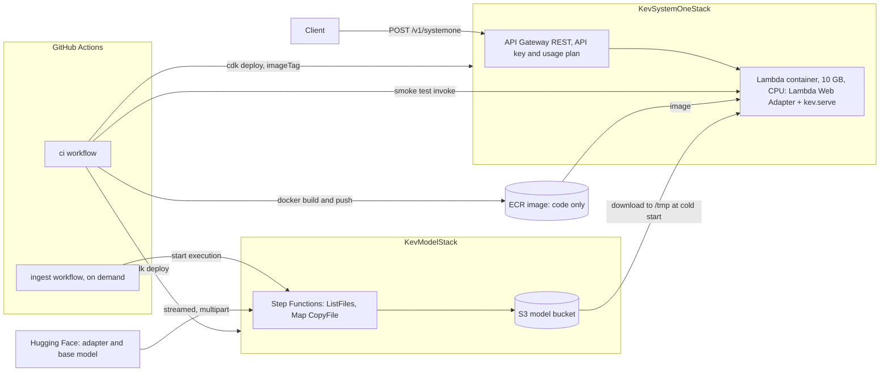

# Kev System One on AWS, serverless

Serves [Kev-0.8B](https://github.com/jaredpalmer/kev/blob/main/docs/model-cards/kev-0.8b.md) (a decision model with
Choice, Score and Noul questions, TypeSafe `POST /v1/systemone` API) from a CPU Lambda container behind API Gateway,
with the model loaded from S3 at cold start.

Kev scores options in one forward pass and does not generate text, so the API does not stream and the model is not a
Bedrock Custom Model Import candidate (Qwen3.5 architecture, adapter-only repo, no LM head).

## Architecture



Request path: client, API Gateway (API key), Lambda container. Model path: Hugging Face to S3 (on demand), then S3 to
the Lambda's `/tmp` at each cold start. The Lambda needs read access to the bucket and no internet access at run time.
Baking the weights into the image was tried and was far slower on Lambda (see Limits).

## Layout

| Path | Purpose |
|---|---|
| `kev_systemone/stacks.py` | CDK: `ModelStack` (bucket, ingest state machine), `SystemOneStack` (Lambda, API) |
| `lambdas/ingest/` | Hugging Face to S3 copy functions |
| `container/` | Inference image: CPU torch, `kev` pinned to a commit, `server.py` entry point |
| `.github/workflows/ci.yml` | Tests, deploys the model stack, builds and pushes the image, deploys the app stack, smoke test |
| `.github/workflows/ingest.yml` | On demand: copies the model from Hugging Face to S3 |
| `samples/choice_noul.py` | Choice, Noul and Score demo against the API |

## CI/CD

Everything runs in GitHub Actions; there are no local CDK commands.

`ci.yml` runs on push to `main` or manual dispatch:

1. `test`: `uv run pytest`.
2. `deploy-model`: bootstraps CDK if `CDKToolkit` is absent, deploys `KevModelStack` (bucket, ingest state machine).
3. `build-and-push` (parallel with 2): creates the ECR repository if missing, builds `container/` and pushes it tagged
   with the git tree hash of `container/`; if an image with that tag exists the build is skipped. Docker layers are
   cached in the GitHub Actions cache.
4. `deploy-app`: deploys `KevSystemOneStack` with `-c imageTag=<tag>`, then invokes the function once with an API Gateway
   event (a cold start, up to a few minutes) and fails the job unless it returns 200 with a Noul answer. The smoke test is
   skipped with a warning if the model bucket is empty. The job summary shows the API URL and API key id.

`ingest.yml` is run by hand, once at the start and whenever the model should change. It runs the state machine (files
already in S3 with the right size are skipped, stale keys are pruned) and waits for it. Inputs override the adapter and
base repos and revisions; revisions default to `main` and are resolved to commit shas. Running Lambda environments keep
the previous model until they are recycled.

First run: push (or run `ci`), which deploys everything but warns that the bucket is empty and skips the smoke test; the
API fails until the model is there. Run `ingest`, then `ci` again to check the deployment end to end.

Repository variables: `AWS_ROLE_ARN` (assumed through OIDC), and optionally `AWS_REGION` (default `us-east-1`) and
`ECR_REPOSITORY` (default `kev-model-systemone-serverless`). The role needs ECR push and create-repository, CDK
bootstrap and deploy (CloudFormation, IAM, Lambda, API Gateway, S3, Step Functions, logs), `s3:ListBucket` on the model
bucket, `cloudformation:DescribeStacks`, `lambda:InvokeFunction` (smoke test), and `states:StartExecution` and
`states:DescribeExecution`.

CDK context values (`-c`): `ecrRepository`, `imageTag` (default `latest`), `adapterRepo` (`jaredpalmer/kev-0.8b`),
`baseRepo` (`Qwen/Qwen3.5-0.8B-Base`).

## Use

```
aws apigateway get-api-key --api-key <ApiKeyId> --include-value --query value --output text
KEV_API_URL=<ApiUrl without trailing slash> KEV_API_KEY=<key> uv run python samples/choice_noul.py
```

## Limits

- State is capped at 8,192 tokens (`MAX_STATE_TOKENS`), the length the model card validates. Longer states return 422.
  The CPU path uses eager attention with an L x L mask, so longer states would not fit in 10 GB.
- Cold start: the Lambda downloads about 1.8 GB from S3 to `/tmp` and loads the model. In an earlier measurement the
  download took about 24 s and the first request about 40 s in total, on top of a 10 s init. API Gateway cuts off at
  29 s, so the first request after idle may return 504; retry. Provisioned concurrency avoids it at a standing cost.
- Baking the weights into the image was tried and abandoned: on Lambda, fresh environments did not finish loading
  within the 120 s function timeout (the staging copy from the image to `/tmp` never completed), against about 24 s for
  the S3 download. The cause is not proven; Lambda loads image contents lazily, which fits the symptom.
- The API key and usage plan (5 req/s, 1,000 req/day) are the only access control.
- The base image (`python:3.12-slim`) is not pinned by digest; it refreshes only when `container/` changes.

## Local test

Put the model under `.models/{adapter,base}` (the files the ingest copies: `*.json`, `*.safetensors`, `*.pt`,
`*.txt`, `*.jinja`), then:

```
docker build -t kev-systemone container
docker run -p 8080:8080 -e MODEL_DIR=/models -v "$PWD/.models:/models" kev-systemone
python samples/choice_noul.py
uv run pytest
```

## Running on SageMaker inference with GPU (guidance, not implemented here)

Use this when the CPU Lambda is too slow, the state length must exceed 8k tokens, or a larger Kev (4B, 9B, 27B) is
needed. `kev.serve` supports CUDA directly; no model code changes are needed. Figures below are from the Kev model
cards and the AWS Pricing API (us-east-1, on demand, 2026-10-07); nothing here has been built or tested in this repo.

**Sizing**

| Model | GPU memory resident (model card) | Instance type to start with |
|---|---|---|
| Kev-0.8B | 3.8 GB | `ml.g6.xlarge` (1 x L4, 24 GB), about $1.13/h |
| Kev-4B | 14.3 GB | `ml.g6.xlarge` (L4, 24 GB), about $1.13/h; `ml.g6e.xlarge` (L40S, 48 GB) about $2.61/h for more headroom |
| Kev-27B | 65.5 GB, peak 87.1 GB at a 64k state | a single 80 GB+ GPU (H100, H200 or B200) and more for the longest states; check which SageMaker instance types offer one in your region |

Check Service Quotas first: the default quota for endpoint usage of GPU instance types is often 0, and an increase can
take time.

**Container**

1. Base the image on a CUDA PyTorch image (not the CPU wheels). Install `kev` as in `container/Dockerfile`, plus the
   `flash-linear-attention` version pinned in `kev/fused_qwen35.py` if you want the fused kernels (`kev.serve` uses
   them when present). `kev.serve` defaults to bf16 and CUDA graphs on CUDA.
2. SageMaker expects the container to serve on port 8080 with `GET /ping` and `POST /invocations`. `kev.serve` serves
   `/v1/systemone` and `/v1/models`, so add a thin wrapper that mounts `kev.serve.app` and adds `/ping` (200 once the
   model is loaded) and `/invocations` (forwards the System One JSON body to the same handler). Drop the Lambda Web
   Adapter.
3. Load weights from `/opt/ml/model`. The ingest already leaves `models/adapter/` and `models/base/` in S3; point the
   model data source at that prefix (uncompressed S3 data source) or package it as `model.tar.gz`. Keep the `head.pt`
   patch from `container/server.py`, which points the adapter at the local base copy.

**Hosting options**

| Option | Behaviour | Cost shape |
|---|---|---|
| Real-time endpoint | Synchronous, `InvokeEndpoint`, lowest latency, no scale to zero | Instance price around the clock, about $822 a month for `ml.g6.xlarge` |
| Asynchronous endpoint | `InvokeEndpointAsync`: request body in S3, result written to S3 and optionally announced on SNS; can scale to zero instances with Application Auto Scaling | Billed only while an instance is up; the first request after idle waits for instance start, image pull and model load (minutes) |

For a demo, asynchronous with scale to zero is the cheapest. System One returns one small JSON result per request, so
the asynchronous pattern costs nothing in function. Put API Gateway and a small Lambda in front: the Lambda writes the
request to S3, calls `InvokeEndpointAsync`, and either polls the output location or returns a job id for the client to
poll. For a synchronous experience, use a real-time endpoint and call `InvokeEndpoint` from the Lambda.

**CI/CD**: reuse the pattern here. Build the image in GitHub Actions and push it to ECR, tagged by content, and deploy
the SageMaker model, endpoint config and endpoint (and the scaling policy) with CDK. Keep the weights out of the image
(baking them into the Lambda image was much slower here); the S3 model data source keeps the image small.
